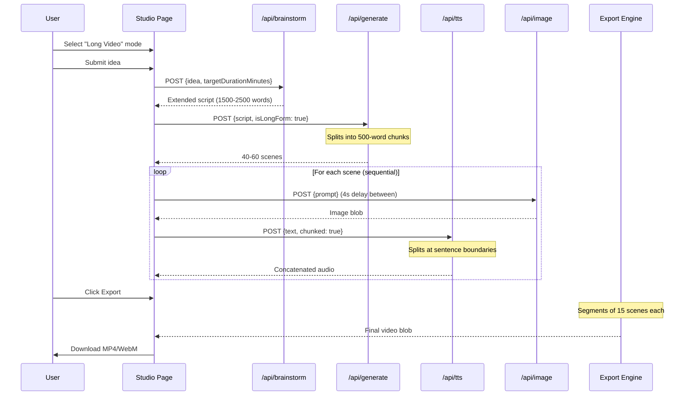

# Design Document: Long Video Export

## Overview

This design extends AI-StoryCraft's existing short-form video pipeline to support long-form YouTube content (10-15 minutes). The current system generates ~60-second videos with 3-10 scenes. The long-form system scales this to 40-60+ scenes, 1500-2500 word scripts, and segmented canvas-based export that avoids browser memory limits.

The architecture preserves the existing API routes (`/api/brainstorm`, `/api/generate`, `/api/tts`, `/api/image`) and extends them with new parameters and chunking strategies. The client-side Studio page gains a mode toggle, progress tracking, and a segmented export pipeline.

Key design decisions:
- **Server-side script chunking**: Long scripts are split into 500-word chunks for scene generation, with context overlap between chunks
- **Client-side TTS chunking**: Dialogue exceeding 200 chars is split at sentence boundaries and concatenated with silence gaps
- **Sequential image generation with delays**: 4-second minimum delay between Pollinations API calls to avoid rate limiting
- **Segmented video export**: Scenes are grouped into 15-scene segments, rendered individually, then concatenated into a single downloadable file
- **Progressive UI**: Real-time progress tracking across all generation phases

## Architecture

```mermaid
graph TD
    subgraph "Client - Studio Page"
        UI[Mode Toggle & Controls]
        PT[Progress Tracker]
        SB[Storyboard Editor]
        SE[Segment Assembler]
        EE[Export Engine]
    end

    subgraph "API Routes (Next.js)"
        B[/api/brainstorm - Extended]
        G[/api/generate - Chunked]
        T[/api/tts - Chunked]
        I[/api/image - Rate Limited]
    end

    subgraph "External Services"
        OAI[OpenAI / Groq API]
        GTTS[Google Translate TTS]
        POLL[Pollinations Image API]
    end

    UI --> B
    UI --> G
    SB --> I
    SB --> T
    SE --> EE
    
    B --> OAI
    G --> OAI
    T --> GTTS
    I --> POLL

    PT -.->|updates| UI
    EE -->|segments| SE
```



## Components and Interfaces

### 1. Long Script Generator (`/api/brainstorm` extension)

```typescript
// Request extension
interface LongBrainstormRequest {
  idea: string;
  characterProfile?: string;
  locationProfile?: string;
  isLongForm: boolean;
  targetDurationMinutes?: number; // 1-20, default 12
}

// Response extension
interface LongBrainstormResponse {
  script: string;
  wordCount: number;
  isIncomplete?: boolean; // true if API failed mid-generation
  estimatedDurationMinutes?: number;
}
```

**Behavior:**
- Calculates target word count: `targetDurationMinutes × 130` (Hindi narration rate)
- Sets `max_tokens: 4096` for long-form generation
- If initial generation < 1500 words, makes up to 3 follow-up calls requesting continuation
- Returns partial script with `isIncomplete: true` on API failure

### 2. Enhanced Scene Divider (`/api/generate` extension)

```typescript
// Request extension
interface LongGenerateRequest {
  script: string;
  targetLanguage: string;
  characterProfile?: string;
  locationProfile?: string;
  characters?: CharacterEntry[];
  isLongForm: boolean;
}

// Response
interface LongGenerateResponse {
  scenes: Scene[];
  totalSceneCount: number;
}

interface Scene {
  imagePrompt: string;
  dialogue: string;
  sceneType: 'establishing' | 'close-up' | 'action' | 'emotional' | 'transition';
  imageUrl?: string;
  audioUrl?: string;
  isThumbnail?: boolean;
  isOutro?: boolean;
}
```

**Behavior:**
- Splits scripts > 1000 words into 500-word chunks
- Each chunk's prompt includes last 2 scenes from previous chunk for narrative continuity
- Enforces 2-4 sentences per scene (sentence = text ending in ।, ., ?, or !)
- Assigns scene types with max 3 consecutive of same type
- Adds thumbnail at position 0, intro at position 1, outro at final position
- If estimated duration < 10 min, splits scenes with > 4 sentences until count ≥ 40

### 3. TTS Chunker (`/api/tts` extension)

```typescript
// Request extension
interface ChunkedTTSRequest {
  text: string;
  chunked?: boolean; // Enable chunking for long text
}

// Response extension
interface ChunkedTTSResponse {
  audioUrl: string; // base64 concatenated audio
  hasIncompleteAudio?: boolean; // true if some chunks failed
  chunkCount?: number;
}
```

**Behavior:**
- Splits text > 200 chars at last sentence boundary (।, ., or comma) within 199 chars
- Falls back to last whitespace if no sentence boundary found
- Generates TTS for each chunk sequentially
- Inserts 100ms silence between chunks
- Retries failed chunks up to 2 times with 2s delay
- Returns concatenated audio even if some chunks fail (with warning flag)

### 4. Scene Batch Processor (Client-side)

```typescript
interface BatchProcessorState {
  status: 'idle' | 'processing' | 'paused' | 'complete' | 'error';
  currentScene: number;
  totalScenes: number;
  percentComplete: number;
  estimatedTimeRemaining: number; // seconds
  successCount: number;
  failedCount: number;
  isPaused: boolean;
  startTime: number;
  generatedAssets: Map<number, { imageUrl?: string; audioUrl?: string }>;
}

interface BatchProcessorConfig {
  imageDelay: number; // minimum 4000ms between image requests
  maxImageRetries: number; // 3
  retryDelay: number; // 10000ms for 429/5xx
  ttsRetries: number; // 2
  ttsRetryDelay: number; // 2000ms
}
```

**Behavior:**
- Processes scenes sequentially for images (4s minimum delay)
- Processes TTS in parallel with image for same scene
- On HTTP 429/5xx: waits 10s, retries up to 3 times
- Failed scenes get placeholder indicator
- Supports pause/resume
- Persists generated assets to `localStorage` for recovery
- Displays summary on completion

### 5. Segment Assembler & Export Engine (Client-side)

```typescript
interface ExportConfig {
  segmentSize: number; // 15 scenes per segment
  videoBitrate: number; // 5_000_000 bps
  audioBitrate: number; // 128_000 bps
  fps: number; // 30
  resolution: { width: number; height: number }; // 1920x1080 or 1080x1920
  maxFileSizeBytes: number; // 2GB
  kenBurnsZoomRange: [number, number]; // [0.05, 0.10]
  kenBurnsPanRange: [number, number]; // [0.05, 0.10]
}

interface SegmentResult {
  blob: Blob;
  sceneRange: [number, number];
  durationMs: number;
}

interface ExportState {
  phase: 'idle' | 'calculating' | 'rendering' | 'concatenating' | 'complete' | 'error';
  currentSegment: number;
  totalSegments: number;
  progressPercent: number;
  estimatedTimeRemaining: number;
  estimatedDuration: string; // "MM:SS"
  error?: string;
  partialBlob?: Blob; // available on error for partial download
}
```

**Behavior:**
- For > 30 scenes: divides into segments of 15
- For ≤ 30 scenes: renders as single segment
- Releases previous segment's memory before processing next
- Uses MediaRecorder with H.264/MP4 when supported, falls back to VP9/WebM
- Ken Burns: 5-10% zoom + 5-10% pan per scene
- Subtitle rendering within 50ms of word timing
- BGM looping with 2s crossfade at loop points
- If estimated file > 2GB: reduces bitrate proportionally
- On failure: offers partial video download

### 6. Video Duration Calculator (Client-side)

```typescript
interface DurationEstimate {
  totalDurationMs: number;
  formattedDuration: string; // "MM:SS"
  thumbnailDurationMs: number; // 3000
  outroDurationMs: number; // 5000
  sceneDurations: number[]; // per-scene audio durations
}
```

### 7. Progress Tracker (Client-side component)

```typescript
interface ProgressPhase {
  id: string;
  label: string;
  status: 'pending' | 'in-progress' | 'complete' | 'error';
  detail?: string; // e.g., "Scene 23/45"
}

interface ProgressTrackerProps {
  phases: ProgressPhase[];
  overallPercent: number;
  estimatedTimeRemaining: number;
  isVisible: boolean;
}
```

### 8. UI Controls (Studio page extension)

```typescript
interface VideoModeState {
  mode: 'short' | 'long';
  targetDurationMinutes: number; // 8-18, default 12
  estimatedDuration: string; // "MM:SS" recalculated on scene changes
  generationTimeEstimate: string; // "MM:SS"
}
```

## Data Models

### Scene Model (Extended)

```typescript
interface ExtendedScene {
  // Existing fields
  imagePrompt: string;
  dialogue: string;
  imageUrl?: string;
  audioUrl?: string;
  isThumbnail?: boolean;
  
  // New fields for long-form
  sceneType?: 'establishing' | 'close-up' | 'action' | 'emotional' | 'transition';
  isOutro?: boolean;
  audioDurationMs?: number;
  hasIncompleteAudio?: boolean;
  hasFallbackImage?: boolean;
  chunkIndex?: number; // which script chunk this scene came from
}
```

### Asset Cache Model (localStorage)

```typescript
interface AssetCache {
  sessionId: string; // unique per generation run
  timestamp: number;
  scenes: Array<{
    index: number;
    imageUrl?: string; // blob URL or base64
    audioUrl?: string; // base64
    status: 'pending' | 'complete' | 'failed';
  }>;
}
```

### Export Session Model

```typescript
interface ExportSession {
  scenes: ExtendedScene[];
  config: ExportConfig;
  segments: SegmentResult[];
  startTime: number;
  status: ExportState;
}
```


## Correctness Properties

*A property is a characteristic or behavior that should hold true across all valid executions of a system—essentially, a formal statement about what the system should do. Properties serve as the bridge between human-readable specifications and machine-verifiable correctness guarantees.*

### Property 1: Script continuation retries until minimum word count

*For any* initial API response with word count less than 1500, the Long_Script_Generator shall make follow-up continuation calls (up to a maximum of 3) until the cumulative word count reaches at least 1500 or the retry limit is exhausted.

**Validates: Requirements 1.4**

### Property 2: Target duration to word count calculation

*For any* valid `targetDurationMinutes` value in the range [1, 20], the Long_Script_Generator shall calculate the target word count as exactly `targetDurationMinutes × 130`.

**Validates: Requirements 1.5**

### Property 3: Invalid target duration rejection

*For any* `targetDurationMinutes` value outside the range [1, 20] (including negative numbers, zero, values > 20, and non-integer values), the Long_Script_Generator shall reject the request with a validation error.

**Validates: Requirements 1.7**

### Property 4: Script chunking produces bounded-size chunks

*For any* text string exceeding 1000 words, the script chunking function shall produce chunks where each chunk contains at most 500 words, and the concatenation of all chunks (minus overlap context) reconstructs the original text.

**Validates: Requirements 2.2**

### Property 5: Scene dialogue sentence count invariant

*For any* scene produced by the Scene_Divider for a long-form script, the dialogue field shall contain between 2 and 4 sentences, where a sentence is defined as text terminated by a purna viram (।), period (.), question mark (?), or exclamation mark (!).

**Validates: Requirements 2.3**

### Property 6: Scene type consecutive constraint

*For any* list of scenes produced by the Scene_Divider, no more than 3 consecutive scenes shall have the same scene type value.

**Validates: Requirements 2.4**

### Property 7: Long-form scene list structural invariant

*For any* scene list generated in long-form mode, the scene at position 0 shall be marked as thumbnail, the scene at position 1 shall be an intro scene, and the scene at the final position shall be marked as outro with call-to-action content.

**Validates: Requirements 2.6**

### Property 8: TTS text chunking respects character limit and boundaries

*For any* text string exceeding 200 characters, the TTS_Chunker shall produce chunks where each chunk is at most 199 characters long, splits occur at the last sentence boundary (।, ., or comma) within the limit when one exists, and no chunk breaks mid-word.

**Validates: Requirements 3.1**

### Property 9: Scene list segmentation

*For any* scene list, the Segment_Assembler shall produce: exactly 1 segment containing all scenes if the count is ≤ 30; or ceil(count / 15) segments where each segment contains exactly 15 scenes except the final segment which contains the remainder, if the count exceeds 30.

**Validates: Requirements 5.1, 5.2**

### Property 10: Video duration calculation

*For any* array of scene audio durations (positive numbers in milliseconds), the Video_Duration_Calculator shall compute the total estimated duration as the sum of all audio durations plus 3000ms (thumbnail) plus 5000ms (outro).

**Validates: Requirements 5.9**

### Property 11: Generation time estimation

*For any* positive scene count and positive total word count, the generation time estimate shall equal `(sceneCount × 7) + (wordCount × 0.5)` seconds.

**Validates: Requirements 6.4**

### Property 12: Ken Burns effect parameters within range

*For any* progress value in [0, 1] and scene configuration, the Ken Burns effect shall produce a zoom factor between 1.05 and 1.10 (5-10% zoom) and a pan offset between 5% and 10% of the respective frame dimension.

**Validates: Requirements 7.3**

### Property 13: File size constraint with adaptive bitrate

*For any* video duration and initial bitrate of 5 Mbps, if the estimated file size (bitrate × duration) exceeds 2 GB (2,147,483,648 bytes), the Export_Engine shall reduce the bitrate such that (adjustedBitrate × duration) ≤ 2 GB. For durations where the initial bitrate produces a file ≤ 2 GB, no adjustment shall occur.

**Validates: Requirements 7.6, 7.7**

## Error Handling

### API Failures

| Scenario | Handling Strategy |
|----------|------------------|
| OpenAI/Groq API timeout during script generation | Return partial script with `isIncomplete: true` flag and word count achieved |
| OpenAI/Groq API timeout during scene generation | Return scenes from completed chunks; display warning for missing scenes |
| Google TTS API failure (single chunk) | Retry up to 2 times with 2s delay; mark chunk as failed if all retries exhausted |
| Google TTS API failure (all chunks for a scene) | Return empty audio with `hasIncompleteAudio: true`; scene plays with images only |
| Pollinations API 429 (rate limited) | Wait 10s, retry up to 3 times; use placeholder on final failure |
| Pollinations API 5xx (server error) | Same as 429 handling |
| Pollinations API timeout (60s) | Treat as failure, apply retry logic |

### Client-Side Failures

| Scenario | Handling Strategy |
|----------|------------------|
| MediaRecorder not supported | Display error message; suggest Chrome/Edge for best compatibility |
| MediaRecorder error during export | Stop processing; offer partial video download of completed segments |
| Memory allocation failure during export | Release current segment resources; offer partial download |
| Audio decode error during export | Skip scene audio; continue rendering with silence for that scene |
| Browser tab closed during generation | Assets already persisted to localStorage; recoverable on return |
| localStorage quota exceeded | Fall back to in-memory storage; warn user that recovery won't be possible |
| Canvas context creation failure | Display error; cannot proceed with export |

### Validation Errors

| Scenario | Handling Strategy |
|----------|------------------|
| `targetDurationMinutes` out of range [1, 20] | Return 400 with validation error message |
| Empty script submitted for generation | Return 400 with "Script is required" error |
| Script below minimum length for long-form (< 100 words) | Warn user; suggest using Short Video mode or expanding script |
| Scene dialogue empty after splitting | Skip scene; log warning |

### Graceful Degradation

- If image generation fails for some scenes: mark with placeholder, continue export with placeholder frames
- If TTS fails for some scenes: export with silence for those scenes; show warning in final summary
- If file size estimation exceeds 2 GB: automatically reduce bitrate; notify user of adjusted quality
- If export fails mid-way: all rendered segments remain available for partial download

## Testing Strategy

### Property-Based Tests

Property-based testing is appropriate for this feature because it contains multiple pure functions with clear input/output behavior and universal invariants (text chunking, math calculations, sequence constraints, partitioning logic).

**Library:** [fast-check](https://github.com/dubzzz/fast-check) (TypeScript PBT library)

**Configuration:** Minimum 100 iterations per property test.

**Properties to implement:**

| Property | Target Function | Generator Strategy |
|----------|----------------|-------------------|
| Property 2: Duration to word count | `calculateTargetWordCount()` | Random integers in [1, 20] |
| Property 3: Invalid duration rejection | `validateTargetDuration()` | Random numbers outside [1, 20] |
| Property 4: Script chunking | `chunkScript()` | Random strings of 1000-5000 words |
| Property 5: Sentence count | `validateSceneSentences()` | Random scene arrays with varied dialogue |
| Property 6: Type sequence | `assignSceneTypes()` / `validateTypeSequence()` | Random arrays of scene types |
| Property 7: Scene structure | `buildSceneList()` | Random scene arrays with mode flags |
| Property 8: TTS chunking | `chunkTextForTTS()` | Random Unicode strings of 200-2000 chars with varied boundary positions |
| Property 9: Segmentation | `segmentScenes()` | Random arrays of 1-100 scenes |
| Property 10: Duration calc | `calculateTotalDuration()` | Random arrays of positive durations |
| Property 11: Gen time estimate | `estimateGenerationTime()` | Random positive scene counts and word counts |
| Property 12: Ken Burns | `calculateKenBurns()` | Random progress values in [0, 1] |
| Property 13: File size | `adjustBitrateForFileSize()` | Random durations from 1s to 1800s |

Each test tagged: `// Feature: long-video-export, Property {N}: {title}`

### Unit Tests (Example-Based)

- Script continuation with mocked API (Property 1 — mocked integration)
- Partial script return on API failure (Requirement 1.6)
- TTS silence insertion between chunks (Requirement 3.4)
- TTS retry behavior with delays (Requirement 3.5)
- Partial audio return with warning flag (Requirement 3.6)
- Batch processor progress updates (Requirement 4.2)
- Batch processor retry on 429/5xx (Requirement 4.3)
- Batch processor pause/resume (Requirement 4.6)
- Asset persistence to localStorage (Requirement 4.8)
- Export progress updates (Requirement 5.5)
- Blob concatenation (Requirement 5.6)
- Partial download on failure (Requirement 5.7)
- UI mode toggle default state (Requirement 6.1)
- Duration slider visibility (Requirement 6.2)
- Confirmation dialog on mode switch (Requirement 6.6)

### Integration Tests

- Full brainstorm → scene generation flow with real API (or mocked)
- TTS chunking end-to-end with concatenation verification
- Batch processor with simulated rate limiting
- Full export pipeline with 5-10 scenes verifying output file
- BGM loop crossfade at loop points (Requirement 7.5)

### Smoke Tests

- MediaRecorder initialized with correct bitrate (Requirement 5.3)
- Canvas dimensions match 1920×1080 or 1080×1920 (Requirement 7.1)
- max_tokens set to ≥ 4096 for long-form (Requirement 1.3)
